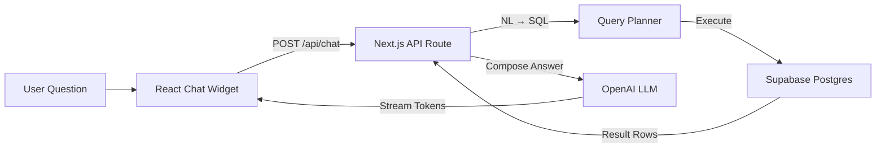

# TripPay

A collaborative trip expense tracker built for groups who travel together. Track shared expenses in real time, split costs fairly, and let AI answer questions about your spending — all from a polished mobile-first interface.

**[Live Demo](https://feldboy.vercel.app)**

---

## Features

- **Real-time collaboration** — expenses sync instantly across all devices via Supabase Realtime
- **User authentication** — email-based auth with Supabase Auth; trip membership and role-based access control
- **Smart expense splitting** — track who paid what, mark shared payments, and see per-person balances
- **AI-powered chat** — ask natural-language questions about your expenses ("What did we spend on food in Tokyo?") powered by OpenAI
- **Multi-currency support** — import credit card statements (CSV/XLSX/OFX) with automatic currency detection
- **Offline-first** — works without internet; queues changes and syncs when back online
- **Export** — generate PDF and Excel reports for trip summaries
- **RTL support** — full Hebrew and English bidirectional text support
- **Responsive design** — glass-morphism UI optimized for mobile and desktop

## Tech Stack

| Layer | Technology |
|-------|-----------|
| Framework | [Next.js 15](https://nextjs.org) (App Router) |
| Language | TypeScript |
| Database | [Supabase](https://supabase.com) (Postgres + Auth + Realtime) |
| Auth | Supabase Auth via `@supabase/ssr` |
| Styling | [Tailwind CSS v4](https://tailwindcss.com) |
| UI Components | [Radix UI](https://radix-ui.com) + [shadcn/ui](https://ui.shadcn.com) |
| Animations | [Framer Motion](https://motion.dev) |
| AI | [OpenAI](https://openai.com) (NL → SQL pipeline) |
| Testing | [Vitest](https://vitest.dev) |
| Deployment | [Vercel](https://vercel.com) |

## Architecture

```
app/                    Next.js App Router pages & API routes
components/             React components (UI, forms, modals, chat)
lib/                    Core utilities (Supabase clients, balance calc, exports)
services/               AI expense query pipeline (NL → SQL → LLM)
src/                    Credit card import parsers & ingestion
hooks/                  Custom React hooks
scripts/                SQL migrations (01–07)
middleware.ts           Auth session refresh & route protection
```

### AI Chat Pipeline



## Getting Started

### Prerequisites

- Node.js 18+
- [pnpm](https://pnpm.io)
- A [Supabase](https://supabase.com) project

### Setup

```bash
# Clone the repository
git clone https://github.com/ShayFeldboy1010/tripay.git
cd tripay

# Install dependencies
pnpm install

# Configure environment variables
cp .env.local.example .env.local
# Edit .env.local with your Supabase and OpenAI credentials
```

### Database

Run the SQL migration scripts in order against your Supabase project (SQL Editor):

```
scripts/01-create-tables.sql
scripts/02-update-schema.sql
scripts/03-add-locations-participants.sql
scripts/04-add-shared-payment.sql
scripts/05-create-ai-expenses-view.sql
scripts/06-add-user-auth.sql
scripts/07-migrate-existing-trips.sql
```

### Run

```bash
pnpm dev          # Start dev server at http://localhost:3000
pnpm build        # Production build
pnpm test         # Run test suite
pnpm lint         # Lint check
pnpm typecheck    # TypeScript check
```

## Project Structure

```
├── app/
│   ├── page.tsx                    # Dashboard (trip list)
│   ├── login/page.tsx              # Authentication
│   ├── signup/page.tsx
│   ├── auth/callback/route.ts      # OAuth callback handler
│   ├── trip/[id]/
│   │   ├── page.tsx                # Trip expenses view
│   │   ├── summary/page.tsx        # Balances, charts, exports
│   │   └── search/page.tsx         # Search & filter expenses
│   └── api/
│       ├── chat/                   # AI chat endpoints
│       └── ai-query/               # Direct AI query endpoint
├── components/
│   ├── ui/                         # Base components (Button, Card, Input)
│   ├── auth-provider.tsx           # Auth context & session management
│   ├── expense-list.tsx            # Expense display with date grouping
│   ├── add-expense-form.tsx        # Create expense modal
│   ├── desktop-shell.tsx           # Desktop sidebar layout
│   ├── mobile-nav.tsx              # Mobile bottom navigation
│   ├── fab.tsx                     # Floating action button
│   └── AIChatWidget.tsx            # AI chat interface
├── lib/
│   ├── supabase/
│   │   ├── client.ts               # Browser client (lazy singleton)
│   │   ├── server.ts               # Server client (cookie-based)
│   │   └── middleware.ts            # Middleware client (session refresh)
│   ├── balance.ts                  # Expense splitting calculations
│   └── export-reports.ts           # PDF & Excel generation
├── services/                       # AI query execution pipeline
├── scripts/                        # SQL migrations (01-07)
└── middleware.ts                   # Route protection & auth
```

## Key Design Decisions

- **Lazy Supabase client** — the browser client uses a `Proxy` to defer initialization until runtime, avoiding build-time crashes when env vars aren't available during static generation
- **SECURITY DEFINER functions** — trip joining and claiming use Postgres functions that bypass RLS to allow operations before membership exists
- **Offline queue** — pending mutations are stored in `localStorage` and replayed on reconnection via a sync manager
- **Glass morphism UI** — consistent design system built on CSS custom properties with dark navy (#0B1020) base theme

## License

MIT
